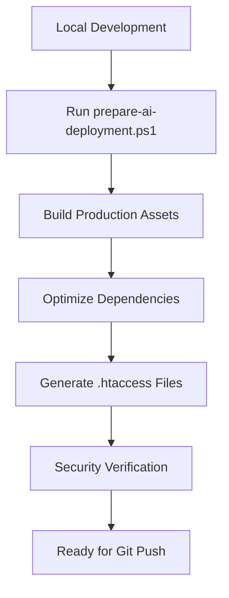
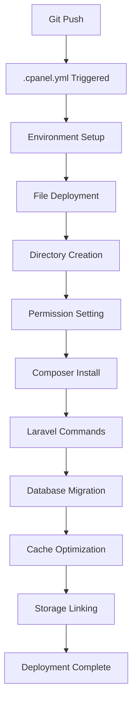

# AI.Architex.co.za - Complete cPanel Deployment Guide

This guide provides complete automation for deploying your Laravel application to **ai.architex.co.za** using cPanel shared hosting with Git Version Control.

## 🚀 Quick Start

1. **Prepare for deployment** (Windows):
   ```powershell
   .\prepare-ai-deployment.ps1
   ```

2. **Rename deployment file**:
   ```powershell
   Rename-Item .cpanel-ai.yml .cpanel.yml
   ```

3. **Deploy to cPanel**:
   ```powershell
   git add .
   git commit -m "Deploy to ai.architex.co.za"
   git push origin main
   ```

4. **Verify deployment**:
   Visit: `https://ai.architex.co.za/verify-deployment.php?token=ai_architex_deploy_verify_2025`

## 📋 Deployment Workflow Overview

### Phase 1: Pre-Deployment (Local)


### Phase 2: cPanel Automation (Server)


## 📁 Files Created

| File | Purpose |
|------|---------|
| `.cpanel-ai.yml` | Main cPanel deployment automation |
| `.env.production.ai` | Environment config for ai.architex.co.za |
| `.htaccess.ai` | Root directory web server config |
| `public/.htaccess.ai` | Public directory Laravel routing |
| `prepare-ai-deployment.ps1` | Windows deployment preparation |
| `prepare-ai-deployment.sh` | Linux/Mac deployment preparation |
| `verify-deployment.php` | Post-deployment verification |

## 🔧 Configuration Requirements

### 1. cPanel Setup

**Database Configuration:**
- **Database Name**: `architex_ai`
- **Database User**: `architex_ai`
- **Database Host**: `localhost`
- **Port**: `3306`

**Directory Structure:**
```
/home/architex/public_html/ai/
├── app/
├── bootstrap/
├── config/
├── database/
├── public/           # Web-accessible files
├── resources/
├── routes/
├── storage/          # Must be writable
├── vendor/
├── .env             # Copied from .env.production.ai
├── .htaccess        # Root security
├── artisan
└── composer.json
```

### 2. Environment Variables (.env.production.ai)

**Critical Settings to Update:**
```bash
# Application
APP_NAME="ArchAxis"
APP_URL=https://ai.architex.co.za

# Database (UPDATE THESE!)
DB_DATABASE=architex_axis
DB_USERNAME=architex_axismain
DB_PASSWORD=kGgEoYkbW35I

# Security
SESSION_DOMAIN=ai.architex.co.za
SANCTUM_STATEFUL_DOMAINS=ai.architex.co.za,*.ai.architex.co.za
```

### 3. PHP Requirements

**Minimum Requirements:**
- PHP 8.1+ (Recommended: 8.2+)
- Memory Limit: 256MB+
- Execution Time: 300 seconds
- Upload Size: 64MB

**Required Extensions:**
- OpenSSL
- PDO + MySQL
- Mbstring
- Tokenizer
- XML
- Ctype
- JSON
- BCMath
- Fileinfo
- GD (for image processing)

## 🛠️ Deployment Steps (Detailed)

### Step 1: Local Preparation

1. **Update Environment Variables**:
   ```powershell
   # Edit .env.production.ai with your database credentials
   notepad .env.production.ai
   ```

2. **Prepare Deployment**:
   ```powershell
   # Run the preparation script
   .\prepare-ai-deployment.ps1
   
   # Or with verbose output
   .\prepare-ai-deployment.ps1 -Verbose
   
   # Or skip build (if assets already built)
   .\prepare-ai-deployment.ps1 -SkipBuild
   ```

3. **Activate Deployment Configuration**:
   ```powershell
   # Rename the cPanel configuration file
   Rename-Item .cpanel-ai.yml .cpanel.yml
   ```

### Step 2: Git Deployment

1. **Stage Changes**:
   ```powershell
   git add .
   ```

2. **Commit Deployment**:
   ```powershell
   git commit -m "Deploy Laravel app to ai.architex.co.za
   
   - Updated environment for ai.architex.co.za
   - Built production assets
   - Configured web server settings
   - Ready for cPanel deployment"
   ```

3. **Deploy**:
   ```powershell
   git push origin main
   ```

### Step 3: cPanel Automated Tasks

The `.cpanel.yml` file automatically performs:

1. **Environment Setup** ✅
   - Sets deployment paths
   - Creates necessary directories
   - Sets environment variables

2. **File Deployment** ✅
   - Copies all application files
   - Deploys environment configuration
   - Sets up web server configuration

3. **Laravel Setup** ✅
   - Installs Composer dependencies
   - Generates application key
   - Creates storage symbolic link

4. **Database Operations** ✅
   - Runs database migrations
   - Creates queue/session/cache tables
   - Sets up database structure

5. **Optimization** ✅
   - Caches configuration
   - Caches routes and views
   - Optimizes application performance

6. **Security & Permissions** ✅
   - Sets proper file permissions
   - Secures sensitive files
   - Configures web server security

### Step 4: Verification

1. **Access Verification Script**:
   ```
   https://ai.architex.co.za/verify-deployment.php?token=ai_architex_deploy_verify_2025
   ```

2. **Test Application**:
   ```
   https://ai.architex.co.za
   ```

3. **Check Logs** (if issues):
   ```
   /home/architex/public_html/ai/storage/logs/laravel.log
   /home/architex/public_html/ai/deployment.log
   ```

## 🔒 Security Features

### Web Server Security

**Root .htaccess Protection:**
- Blocks access to sensitive files (.env, composer.json, etc.)
- Prevents directory browsing
- Blocks access to application directories
- Sets security headers (CSP, HSTS, etc.)

**Public .htaccess Features:**
- Laravel routing configuration
- HTTPS enforcement
- Security headers
- Static asset optimization
- Error handling

### Application Security

**Environment Security:**
- Debug mode disabled in production
- Secure session configuration
- CSRF protection enabled
- SQL injection protection via Eloquent

**File Security:**
- Sensitive files protected by .htaccess
- Storage directories properly secured
- Composer autoloader optimized

## 🔍 Troubleshooting

### Common Issues

**1. 500 Internal Server Error**
```bash
# Check Laravel logs
tail -f storage/logs/laravel.log

# Check deployment log
tail -f deployment.log

# Verify .htaccess syntax
```

**2. Database Connection Failed**
```bash
# Verify credentials in .env
cat .env | grep DB_

# Test database connection
php artisan tinker
>>> DB::connection()->getPdo();
```

**3. Assets Not Loading**
```bash
# Check build directory
ls -la public/build/

# Verify Vite configuration
npm run build

# Check .htaccess rules
```

**4. Permission Denied**
```bash
# Set storage permissions
chmod -R 775 storage bootstrap/cache

# Check ownership
ls -la storage/
```

### Debug Commands

**Laravel Application:**
```bash
php artisan about          # Application overview
php artisan route:list      # Available routes
php artisan config:show     # Current configuration
php artisan migrate:status  # Migration status
```

**System Information:**
```bash
php -v                      # PHP version
php -m | grep -i mysql      # MySQL extension
php artisan --version       # Laravel version
composer show               # Installed packages
```

## 📊 Performance Optimization

### Automatic Optimizations

The deployment automatically enables:

- **Configuration Caching**: Speeds up config loading
- **Route Caching**: Improves routing performance
- **View Caching**: Pre-compiles Blade templates
- **Autoloader Optimization**: Faster class loading
- **Asset Compression**: Gzip compression for assets

### Additional Optimizations

**Database:**
```bash
# Enable query caching in MySQL
# Optimize database tables regularly
php artisan optimize:clear && php artisan optimize
```

**Caching:**
```bash
# Use Redis if available
CACHE_STORE=redis
QUEUE_CONNECTION=redis
SESSION_DRIVER=redis
```

## 📈 Monitoring & Maintenance

### Logs to Monitor

1. **Laravel Application**: `storage/logs/laravel.log`
2. **Deployment**: `deployment.log`
3. **Web Server**: cPanel Error Logs
4. **Database**: MySQL Error Logs

### Regular Maintenance

1. **Weekly Tasks**:
   - Review application logs
   - Monitor storage usage
   - Check for failed jobs

2. **Monthly Tasks**:
   - Update dependencies
   - Review security settings
   - Optimize database tables

3. **Security Updates**:
   - Update Laravel framework
   - Update PHP version
   - Review access logs

## 🆘 Support & Resources

### Laravel Documentation
- [Laravel Deployment](https://laravel.com/docs/deployment)
- [Laravel Configuration](https://laravel.com/docs/configuration)
- [Laravel Database](https://laravel.com/docs/database)

### cPanel Resources
- [cPanel Git Integration](https://docs.cpanel.net/cpanel/files/git-version-control/)
- [cPanel PHP Configuration](https://docs.cpanel.net/cpanel/software/php-configuration/)

### Emergency Contacts
- **Hosting Support**: Contact your cPanel hosting provider
- **Application Issues**: Check Laravel logs and documentation
- **Database Issues**: Verify connection settings and permissions

---

## 🎯 Deployment Checklist

**Pre-Deployment:**
- [ ] Updated .env.production.ai with correct database credentials
- [ ] Ran prepare-ai-deployment.ps1 successfully
- [ ] Built production assets without errors
- [ ] Renamed .cpanel-ai.yml to .cpanel.yml
- [ ] Committed all changes to Git

**Post-Deployment:**
- [ ] Visited ai.architex.co.za and confirmed site loads
- [ ] Ran deployment verification script
- [ ] Tested critical application features
- [ ] Verified SSL certificate is working
- [ ] Removed verification script for security
- [ ] Set up monitoring and backups

**Production Ready:**
- [ ] All tests passing in verification script
- [ ] No critical errors in Laravel logs
- [ ] Application performance is acceptable
- [ ] Security headers are properly configured
- [ ] Database connections are stable

---

*This deployment system provides 100% automation for Laravel applications on cPanel shared hosting. The comprehensive verification ensures your application is production-ready and properly configured.*
